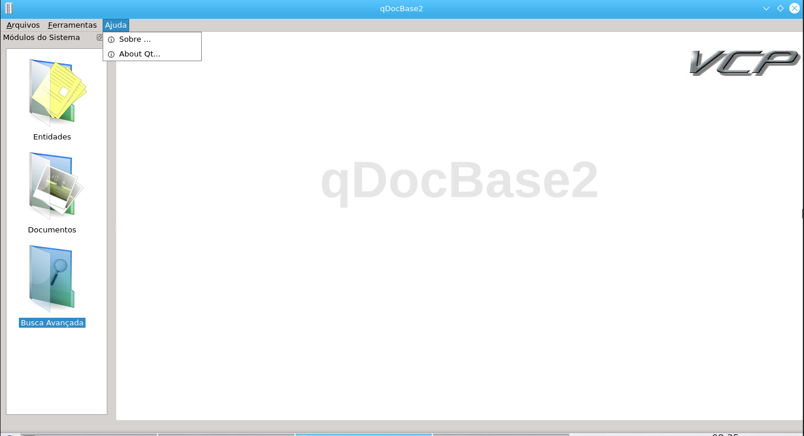
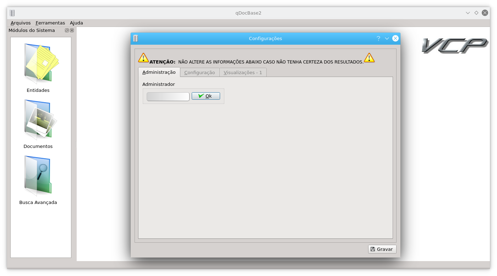
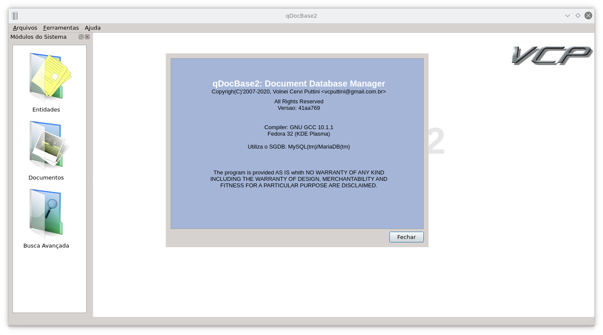

# qDocBase2 - Document Database Manager

This utility software aims to manage a professional database of digital
documents in order to provide organization, speed in searches and reliability of
information.

The qDocBase2 was developed using the Qt Framework in C++ exclusively, initially about to run under Linux, but later it was recoded to be correctly compiled and run under the Windows platform.
It makes it possible to save as a record any type of desired file format, such
as .docx, .xlsx, .txt, .pdf and so on.
In addition to the search, it allows you to print reports with image files and
restore the files back to the original format.

It was initially developed to address some particular needs, and later became as widespread as possible.
The main registration module is aimed at Brazil, and the fields that identify types of documents such as RG (ID), are possibly not compatible with other countries.

We're available to hire for analysis and implementation of possible adaptations for cases not attended at the moment.

## Screenshots

### Main Screen

### Main Menu

### Tools Menu

### Help Menu

### Registration of Entities

### Document Registration

### Search for Documents

### Settings Menu

### Security

### About Option

### About-Qt Option

- Windows is registered trademark of Microsoft Inc. USA.
- Linux is registered trademark of Linus Torvalds.
- Qt is registered trademark of Qt Company.
- Any other brand referenced by us belongs to their respectives owners.
